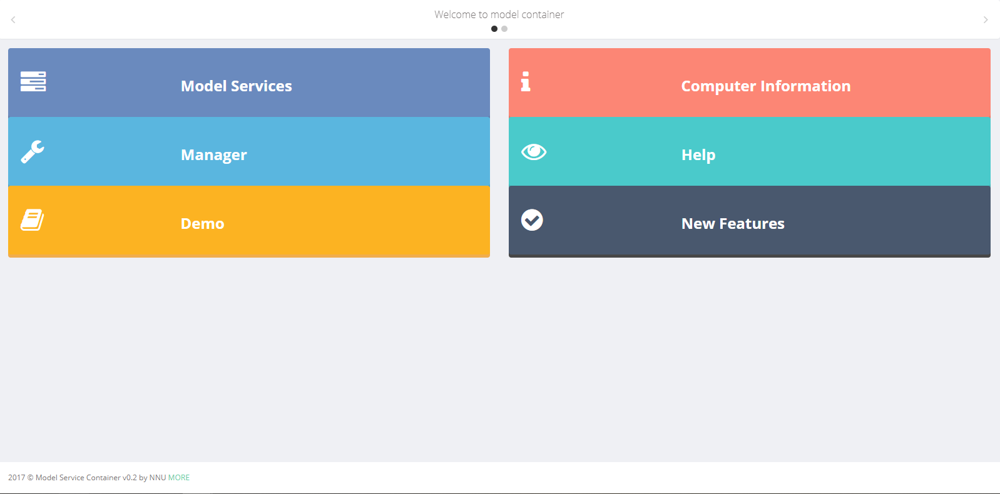
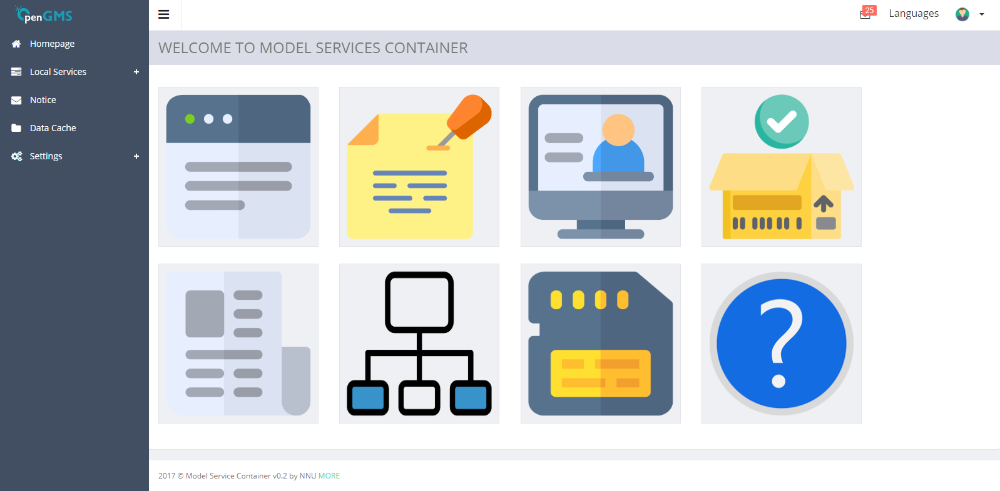
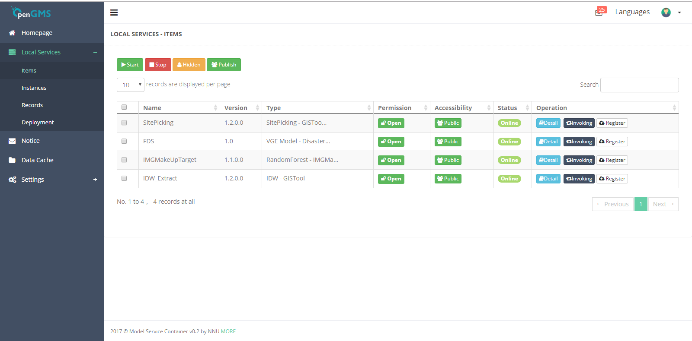
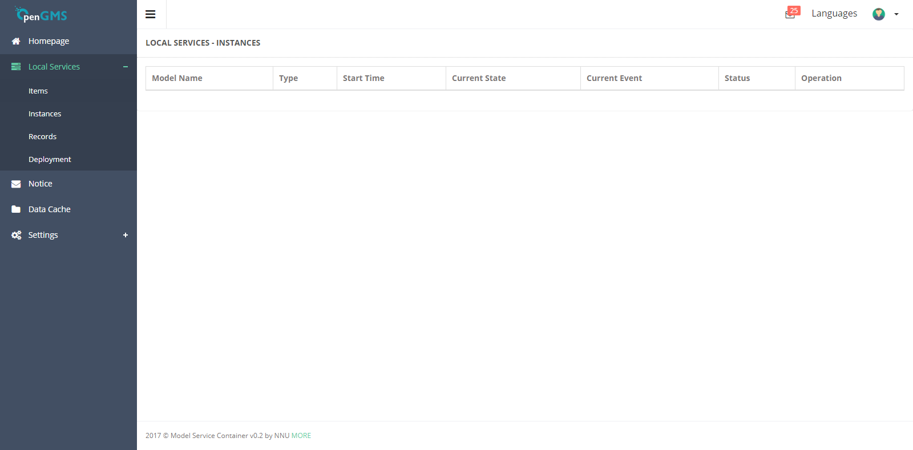
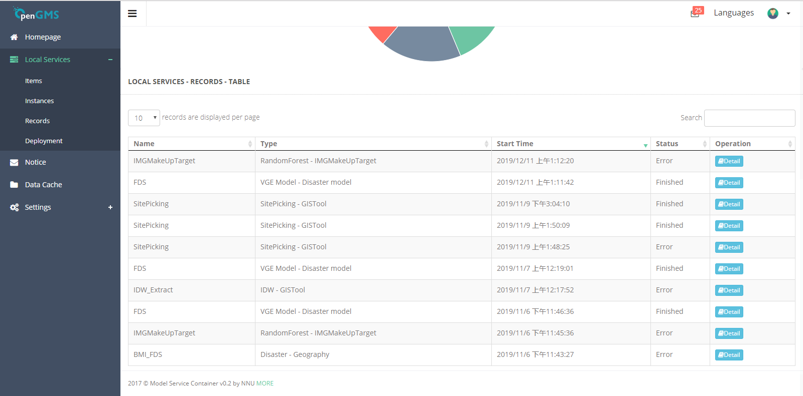
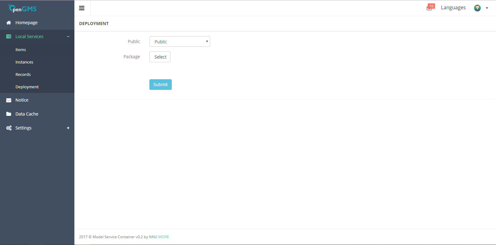
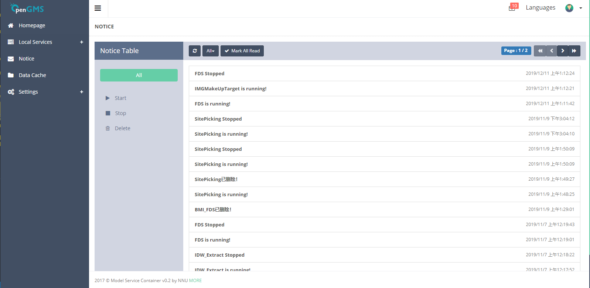
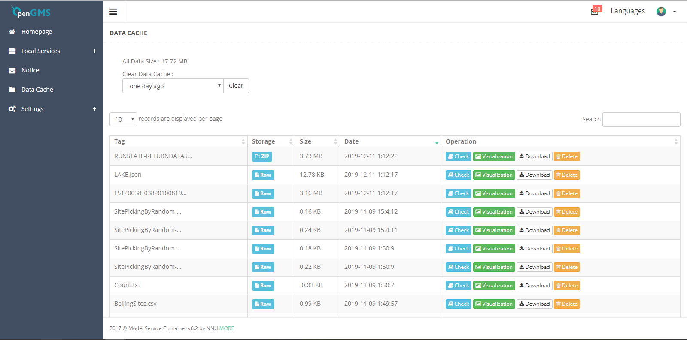
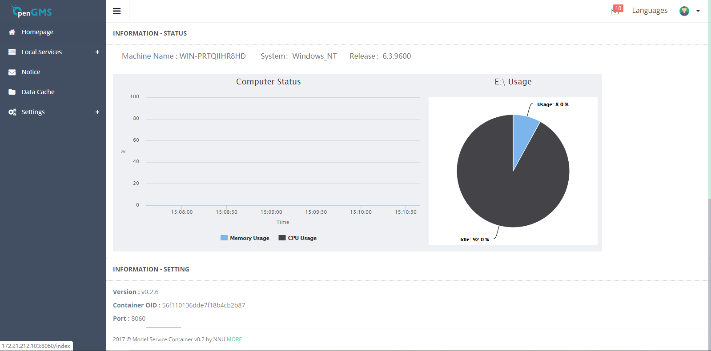
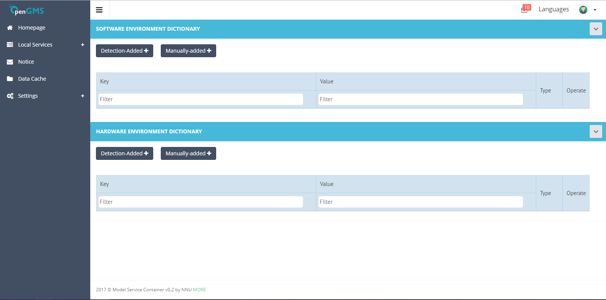

# OpenGMS Wrapper System

[](http://geomodeling.njnu.edu.cn/)

OpenGMS Wrapper System is a service loader and manager that can be used to publish services offered by the models on the web. This project is funded by OpenGMS, which aims to model the geographical phenomena and processes in open web environment.


## Introduction

The OpenGMS Wrapper System is a service-oriented system, which aims to share and reuse standard model service on the web. It can deploy such models, manage related geosimulation resources on computing nodes, and invoke and running geoanalysis models in the open web environment. The above functions also benefit interactions among the wrapper system, geoanalysis models, and model users. In addition, service-oriented geoanalysis model services can help eliminate many unnecessary procedures in model use.

It uses Nodejs as service loader and Reactjs as management UI.


## Framework

### Overview

- bin : entry files
    - www : setup file
- control : this layer is for logic control
- doc : files for documentation (README.md)
- geo_data : data cache file for I/O
- geo_dataMapping : assemblies for data mapping or other functions
- geo_model : models service related files
- helper : environment middle files
- model : this layer is for model for basic operation (include database and files)
- public : static files
- router : this layer is for HTTP route
- socket : this layer if for SOCKET route
- upload : batch model service deploying
- utils : common method
- views : ejs pages template
- views_src : react pages components
- app.js : main configuration file
- batchUpload.js : batch model service deployment
- debug.js : debug file
- init.js : initialization file
- package.json : nodejs package configuration file
- pm2.json : pm2 setup configuration
- register.js : register to task server
- setting.js : setting file


## API

### _Get Model Service JSON_

* URL : _/modelser/json/[msid]_ // _[msid]_ is the model service id in the system
* Method : GET
* Response : 

```json
{
    "result" : "[result]", // [result] can be 'suc', 'err'
    "code" : [code], // [code] shows 1 which means successful request, -1 means err
    "data" : {}, // model service information items
    "message" : "[msg]" // message for error or other notice in request
}
```

#### _Get All Model Service JSON_

* URL : _/modelser/json/all_
* Method : GET
* Response : 

```json
{
    "result" : "[result]", // [result] can be 'suc', 'err'
    "code" : [code], // [code] shows 1 which means successful request, -1 means err
    "data" : [ // model service information item collection
        {} // model service information items
    ],
    "message" : "[msg]" // message for error or other notice in request
}
```

### _Get Model Service by PID or MID_

* URL : _/modelser?ac=search&mid=[mid]&pid=[pid]_ // _[mid]_ is the model id and _[pid]_ is the model package id
* Method : GET
* Response : 

```json
{
    "result" : "[result]", // [result] can be 'suc', 'err'
    "code" : [code], // [code] shows 1 which means successful request, -1 means err
    "data" : [ // model service information item collection
        {} // model service information items
    ],
    "message" : "[msg]" // message for error or other notice in request
}
```

### _Invoke Model Service by MSID_

* URL : _/modelser/[msid]&ac=run?_ // _[msid]_ is the model service id in the system
* Method : GET or POST // if GET the form data should be formated in URL and POST the form data should be form in request body
* Form : 

```json
{
    "inputData" : [ // input data for model running
        {
            "StateId" : "[sid]", // state id
            "StateName" : "[sname]", // state name, any state id or state name can be conigured !!! If both configured, state id first
            "Event" : "[eventname]", // event name
            "DataId" : "[dataid]", // uploaded data id
            "Destoryed" : "[destroy]" // default as 'false'. 'true' means the data would be deleted aterter download
        }
    ],
    "outputData" : [ // output data configuration
        {
            "StateId" : "[sid]", // state id
            "StateName" : "[sname]", // state name, any state id or state name can be conigured !!! If both configured, state id first
            "Event" : "[eventname]", // event name
            "DataId" : "[dataid]", // uploaded data id
            "Destoryed" : "[destroy]" // default as 'false'. 'true' means the data would be deleted aterter download
        }
    ],
    "cp" : [], // control parameter

}
```

* response :

```json
{
    "result" : "[result]", // [result] can be 'suc', 'err'
    "code" : [code], // [code] shows 1 which means successful request, -1 means err
    "data" : [msrid], // model service running record id
    "message" : "[msg]" // message for error or other notice in request
}
```

### _Get Model Service I/O Information_

* URL : _/modelser/inputdata/[msid]_ // _[msid]_ is the model service id in the system
* Method : GET
* Response : 

```json
{
    "result" : "[result]", // [result] can be 'suc', 'err'
    "code" : [code], // [code] shows 1 which means successful request, -1 means err
    "data" : { // model service information about I/O
        "States" : [ // states
            {
                "$" : {},
                "Event" : [
                    {
                        "$" : {},
                        "ResponseParameter / DispatchParameter" : {} 
                    }
                ]
            }
        ],
    },
    "message" : "[msg]" // message for error or other notice in request
}
```

### _Get Model Service Running Instance Information_

* URL : _/modelins/json/[guid]_ // _[guid]_ is the model service running instance id in the system
* Method : GET
* Response : 

```json
{
    "result" : "[result]", // [result] can be 'suc', 'err'
    "code" : [code], // [code] shows 1 which means successful request, -1 means err
    "data" : { // model service running instance
    },
    "message" : "[msg]" // message for error or other notice in request
}
```

### _Operator Model Service Running Instance_

* URL : _/modelins/[guid]?ac=[action]_ // _[guid]_ is the model service running instance id in the system, _[action]_ can be _kill_, _pause_, _resume_, _updatedata_. _kill_ means stop the model running, _pause_ means temporary pause, _resume_ means resume from pause and _updatedata_ can update input data before requested
* Method : PUT
* Response : 

```json
{
    "result" : "[result]", // [result] can be 'suc', 'err'
    "code" : [code], // [code] shows 1 which means successful request, -1 means err
    "data" : { //
    },
    "message" : "[msg]" // message for error or other notice in request
}
```

### _Operator Model Service Running Instance_

* URL : _/modelserrun/json/[msrid] // _[msrid]_ is the model service running record id in the system
* Method : GET
* Response : 

```json
{
    "result" : "[result]", // [result] can be 'suc', 'err'
    "code" : [code], // [code] shows 1 which means successful request, -1 means err
    "data" : { // model service running record information about I/O
    },
    "message" : "[msg]" // message for error or other notice in request
}
```


## Public UI



## Management UI

### Homepage

### Local Services
#### Items

#### Instances

#### Records

#### Deployment

### Notice

### Data Cache

### Settings
#### Information

#### Environment


## Download

Windows (update at Oct 25 2015) [v0.2.11]()

## Install


## License

[AGPL](./LICENSE)

When using the Wrapper System or other GitHub logos, be sure to follow the [GitHub logo guidelines](https://github.com/logos).

## Reference 

[Zhang, F., Chen, M., Ames, D. P., Shen, C., Yue, S., Wen, Y., & Lü, G. (2019). Design and development of a service-oriented wrapper system for sharing and reusing distributed geoanalysis models on the web. Environmental modelling & software, 111, 498-509.](https://www.sciencedirect.com/science/article/pii/S1364815218310478)

## Contributors
### Founders/Designers
Min Chen (<chenmin0902@163.com>) 

Yongning Wen (<wenyn@msn.com>)

Songshan Yue (<yss123yss@126.com>)

Fengyuan Zhang (<franklinzhang@foxmail.com>)

Chaoran Shen (<shenchaoran212@gmail.com>)

Ming Wang (<wangminggis@163.com>) 

### Coders
Fengyuan Zhang (<franklinzhang@foxmail.com>) 

Chaoran Shen (<shenchaoran212@gmail.com>)

Ming Wang (<wangminggis@163.com>) 

All codes are used in [OpenGMS](http://geomodeling.njnu.edu.cn/) platform